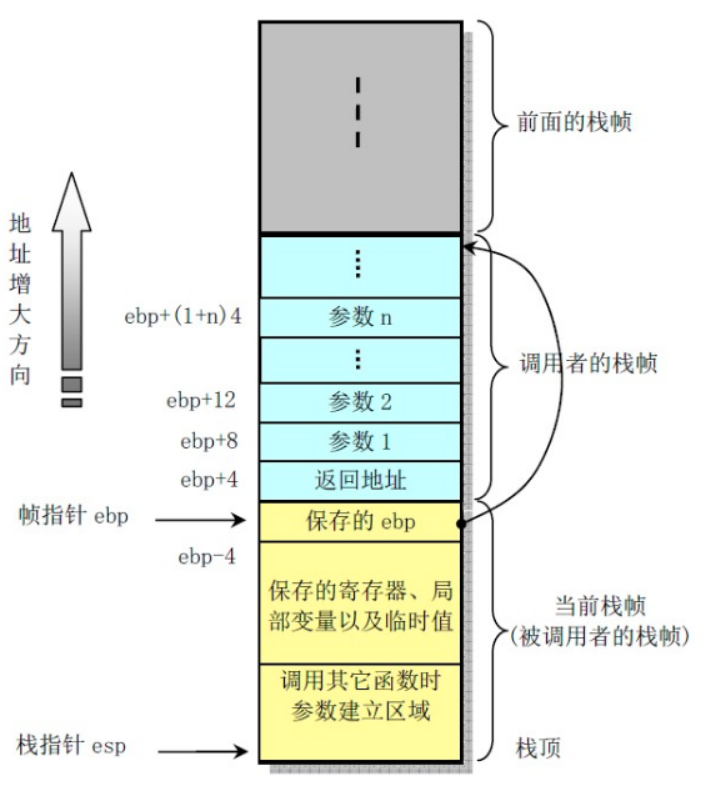

# 编译原理实验四报告

|     学号      |    姓名    |            邮箱            |   提交日期    |
| :-----------: | :--------: | :------------------------: | :-----------: |
| **181860109** | **吴润泽** | 181860109@smail.nju.edu.cn | **2021/5/16** |

## 实现功能

自己采用IR直接对应目标代码、简单扫描分配变量栈空间、朴素寄存器分配的方法。

### 预扫描分配变量栈空间

#### 变量 Variable_

```c
struct Variable_ {
    Operand op; 	 // 变量对应的操作数
    int offset;  	       // 变量在栈中的偏移量，相对于fp
    int reg_no;  	    // 变量所在寄存器编号
};
```

为了寻址的简单，我使用 `$ebp` 相对寻址的方式，记录每个变量相对于 `$ebp` 的偏移量。

为保证在指令中出现的变量、临时变量、地址、数组在使用和定义时在栈上分配空间。我采用预处理每个函数块的方式，扫描函数块中所有的 `Operand` ，在未被分配时给其在栈上分配空间，记录相应的偏移量，并将其加入已分配变量的链表 `local_varlist` 中。

### 朴素寄存器分配

#### 寄存器 Register_

```c
struct Register_ {
    char* name;                            // 寄存器的别名
    enum { FREE, BUSY } state;  // 寄存器是否被使用
    Variable var;                           // 寄存器当前存放的变量
}
```

为了避免破坏MIPS约定使用的寄存器，以及实现的方便，在实验中可以分配的寄存器只有调用者保存的 `t0-t7`。

在使用时，调用 `get_reg(op)`，首先将 `op` 对应的变量加载到寄存器上，在完成相应的计算后，如果 `op` 对应的变量发生了修改，则将其写回所在的栈空间。

### 函数栈空间管理

我仿照x86进行本次实验中函数调用和栈帧的管理。



## 编译&测试方式

进入 `Code` 文件夹所在路径，执行 `make` 命令，即可获得 **parser** 可执行文件。

执行 `./parser filenamae asm_path` 命令，即可对一个待测试的源文件进行词法、语法、语义的分析，并生成相应的中间代码，并将中间代码翻译成MIPS32汇编代码，输出到 `asm_path` 中。

